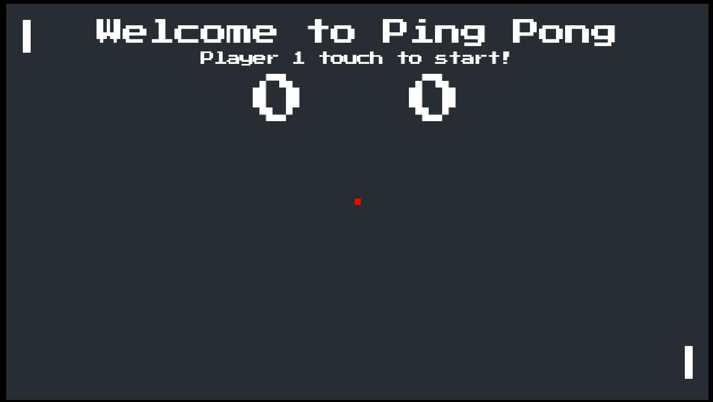
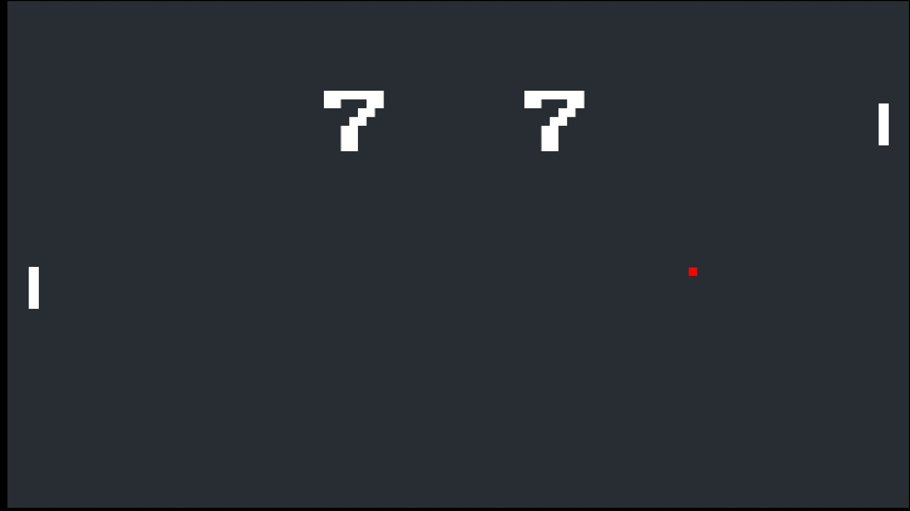
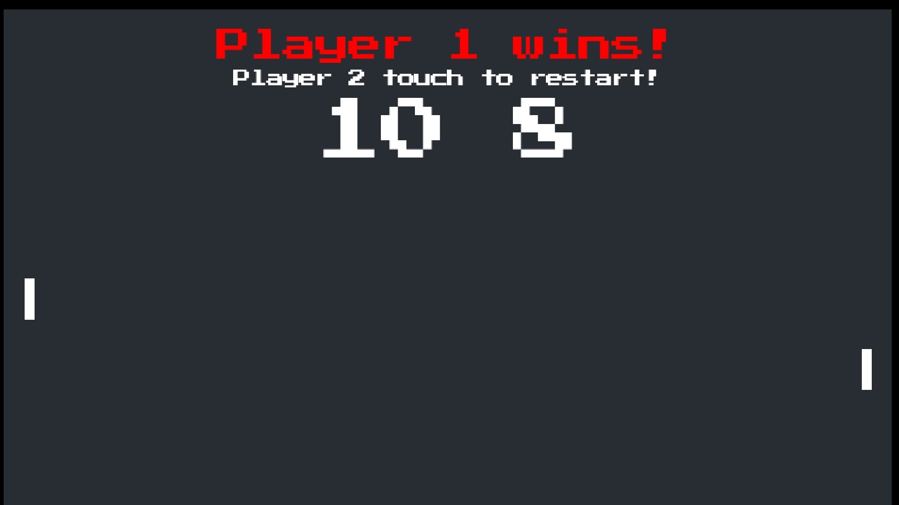

# Ping Pong

A reimagining of Pong (Atari, 1972) built as a learning project.

## About

Built following CS50's Introduction to Game Development course.
This is a two-player table tennis arcade
game adapted entirely for touch input on Android. No keyboard needed.

## How to Play

- Left player — tap left half of screen to move up or down
- Right player — tap right half of screen to move up or down
- First to 10 points wins
- Tap to serve, tap to restart

## Built With

- [LÖVE2D](https://love2d.org) — 2D game framework
- [Lua](https://lua.org) 5.4.8
- Built entirely on a OnePlus 6 Android phone using [Acode](https://play.google.com/store/apps/details?id=com.foxdebug.acodefree) editor

## Screenshots

## Download

Download the APK from the [Releases](https://github.com/srikanth9x/ping-pong/releases/latest) page.

## Credits

- Course: [CS50 Game Development](https://cs50.harvard.edu/games) — Harvard University
- Instructor: [Colton Ogden](https://github.com/coltonoscopy)
- Assets: CS50 Game Development — [github.com/games50](https://github.com/games50)
- Original game concept: Pong — Atari Inc. (1972)

## Disclaimer

This is an independent fan remake for educational purposes only.
Not affiliated with or endorsed by Atari Inc.

## License

MIT License — Copyright (c) 2026 [Bandari Srikanth](https://srikanth9x.pages.dev)